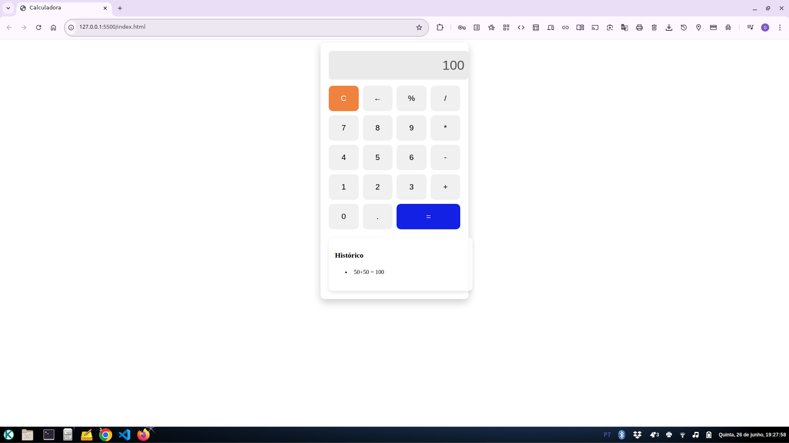

## 🧮 Calculadora Responsiva
Simples, elegante e pronta para funcionar em qualquer dispositivo.

### 💡 O que é?
Uma calculadora web em **HTML**, **CSS** e **JavaScript** que realiza as operações básicas (adição, subtração, multiplicação, divisão, porcentagem), com histórico de cálculos integrados e layout responsivo.



### 🚀 Funcionalidades principais

- **Operações básicas:** `+` `-` `*` `/` `%`
- **Botões especiais:**
  - `C` para limpar o display
  - `←` para apagar o último dígito
  - `=` para calcular o resultado
- **Histórico dinâmico:** lista os cálculos realizados em sessão
- **Design responsivo:** adapta-se a **desktop**, **tablet** e **celular**

### 🛠️ Tecnologias

- **HTML5** para a estrutura
- **CSS3** para layout responsivo
- **JavaScript** puro para a lógica de cálculo e histórico

### ⚙️ Como usar
1. Clone o repositório: 
   ```bash
   git clone https://github.com/gizbra/calculadora.git
   ```
3. Abra o `index.html` no seu navegador.

E pronto! 🎉 A calculadora vai carregar e já estará pronta para uso.

